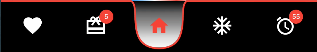
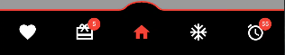
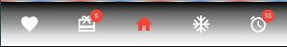
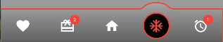
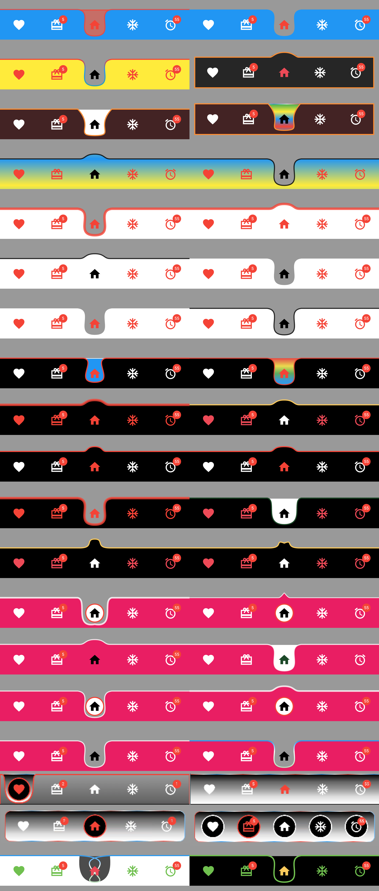

# Ultimate Bottom Navigation Bar

Ultimate Bottom Navigation Bar is a customizable bottom navigation bar for your Flutter applications. It allows you to easily create a navigation bar with icons and titles, and customize various aspects of its appearance and behaviors.

## Under Curve



## Upper Curve



## No Curve



## Static Curve


## Dynamic Curve




## Other Customiztions



## How To Use

Ultimate Bottom Navigation Bar can be used with Scaffold by setting up at bottomNavigationBar property.

Add this to your package's pubspec.yaml file, use the latest version

```yaml
dependencies:
  ultimate_bottom_navbar: ^latest_version
```

```dart
import 'package:ultimate_bottom_navbar/ultimate_bottom_navbar.dart';
    int currentIndex = 0;

    final List<String> title = [
        "Favourite",
        "Wallet",
        "Home",
        "Freeze",
        "Alarm"
    ];

    final List<IconData> icons = [
        Icons.favorite, 
        Icons.wallet_giftcard_sharp, 
        Icons.home, 
        Icons.ac_unit_outlined, 
        Icons.access_alarm_rounded, 
    ];

    final List pages = [
        const Page1(),
        const Page2(),
        const Page3(),
        const Page4(),
        const Page5(),
    ];
  
  @override
  Widget build(BuildContext context) {
    return Scaffold(
        body: pages[currentIndex],
        bottomNavigationBar: UltimateBottomNavBar(
            icons         : icons,
            titles        : title,
            currentIndex  : currentIndex,
            onTap         : (index) async => onItemTapped(index), 
        ),
    );
  }

  void onItemTapped(int index) async{
    setState(() {
        currentIndex = index;
    });
  }
```

## RTL Support

Works For Both RTL and LTR and can be configured with `Directionality`:

```dart
Directionality(
  textDirection: TextDirection.rtl,
  child: Scaffold(bottomNavigationBar:UltimateBottomNavBar()),
)
```

## Controls For Upper And Under Curve And Stroke Borders

- Upper Curves:

- Control the width and shape of the upper curves using various X and Y control points.
- Adjust stroke properties for the upper curves, such as width and control points.

- Under Curves:

- Manage the width and shape of the under curves with specific X and Y control points.
- Modify stroke properties for the under curves, including width and control points.
  
These properties collectively allow users to finely control the appearance of upper and under curves, as well as stroke borders, providing flexibility in customizing the graphical elements of the interface.

## Properties

| Property                         | Description                                                                     |
|----------------------------------|---------------------------------------------------------------------------------|
| icons                            | Required Icons                                                                  |
| titles                           | Required Titles Use Empty Text For No Title                                     |
| currentIndex                     | Required Current Selected Index                                                 |
| backgroundColor                  | Solid Background Color                                                          |
| foregroundColor                  | Solid Foreground Color                                                          |
| foregroundStrokeBorderColor      | Foreground Stroke Solid Border Color                                            |
| backgroundStrokeBorderColor      | Background Stroke Solid Border Color                                            |
| backgroundStrokeBorderWidth      | Background Stroke Border Thickness                                              |
| foregroundStrokeBorderWidth      | Foreground Stroke Border Thickness                                              |
| backgroundGradient               | Background Gradient Color                                                       |
| foreGroundGradientShader         | Foreground Gradient Shader Color                                                |
| foregroundStrokeGradientShader   | Foreground Stroke Border Gradient Shader Color                                  |
| backgroundStrokeGradientShader   | Background Stroke Border Gradient Shader Color                                  |
| navMargin                        | Bottom Navigation Margin                                                        |
| backgroundBorderRadius           | Background Border Radius                                                        |
| selectedIconColor                | Selected Icon Color                                                             |
| selectedIconSize                 | Selected Icon Size                                                              |
| selectedTextSize                 | Selected Text Size                                                              |
| selectedTextColor                | Selected Text Color                                                             |
| unselectedIconColor              | Unselected Icon Color                                                           |
| unselectedIconSize               | Unselected Icon Size                                                            |
| unselectedTextSize               | Unselected Text Size                                                            |
| unselectedTextColor              | Unselected Text Color                                                           |
| showForeGroundStrokeAllSide      | Show Foreground Stroke Border All Sides                                         |
| showBackGroundStrokeAllSide      | Show Background Stroke Border All Sides                                         |
| useForeGroundGradient            | Use Foreground Gradient Color                                                   |
| showForeGround                   | Show Hide Foreground                                                            |
| useForegroundShaderStroke        | Use Foreground Shader Border Stroke Color                                       |
| useBackgroundShaderStroke        | Use Background Shader Border Stroke Color                                       |
| underCurve                       | Under Curve Or Upper Curve                                                      |
| staticCurve                      | Static Curve Or Dynamic Curve                                                   |
| showCircleStaticMidItemStatic    | Show Circle Decoration For Static Curve                                         |
| midItemCircleColorStatic         | Mid Item Circle Color For Static Curve                                          |
| midItemCircleBorderColorStatic   | Mid Item Circle Border Color For Static Curve                                   |
| showMidCircleStatic              | Show Mid Circle Or Hide For Static Curve                                        |
| midCircleRadiusStatic            | Mid Circle Radius For Static Curve                                              |
| midCircleBorderRadiusStatic      | Mid Circle Border Radius For Static Curve                                       |
| customSelectedItemDecor          | Custom Selected Item Decoration                                                 |
| customUnSelectedItemDecor        | Custom Unselected Item Decoration                                               |
| badgeData                        | Badge Data For Individual Item                                                  |
| badgeColor                       | Badge Background Color                                                          |
| badgeTextStyle                   | Badge Text Style                                                                |
| badgeCircleRadius                | Badge Circle Radius                                                             |
| badgeTopPosition                 | Badge Top Position                                                              |
| badgeBottomPosition              | Badge Bottom Position                                                           |
| badgeLeftPosition                | Badge Left Position                                                             |
| badgeRightPosition               | Badge Right Position                                                            |
| backgroundHeight                 | Height for Background Container                                                 |
| foregroundHeight                 | Height for Foreground Container                                                 |
| animationType                    | Animation Type                                                                  |
| animationDuration                | Animation Duration                                                              |
| onTap                            | Item Tap Function                                                               |
| upperCurveWidthCtrl              | Controls the width of the upper curve.                                          |
| leftX1UpperCurveCtrl             | Controls the x-coordinate of the left control point 1.                          |
| leftY1UpperCurveCtrl             | Controls the y-coordinate of the left control point 1.                          |
| leftX2UpperCurveCtrl             | Controls the x-coordinate of the left control point 2.                          |
| leftY2UpperCurveCtrl             | Controls the y-coordinate of the left control point 2.                          |
| leftX3UpperCurveCtrl             | Controls the x-coordinate of the left control point 3.                          |
| leftY3UpperCurveCtrl             | Controls the y-coordinate of the left control point 3.                          |
| rightX1UpperCurveCtrl            | Controls the x-coordinate of the right control point 1.                         |
| rightY1UpperCurveCtrl            | Controls the y-coordinate of the right control point 1.                         |
| rightX2UpperCurveCtrl            | Controls the x-coordinate of the right control point 2.                         |
| rightY2UpperCurveCtrl            | Controls the y-coordinate of the right control point 2.                         |
| rightX3UpperCurveCtrl            | Controls the x-coordinate of the right control point 3.                         |
| rightY3UpperCurveCtrl            | Controls the y-coordinate of the right control point 3.                         |
| upperStrokeCurveWidthCtrl        | Controls the width of the upper stroke curve.                                   |
| leftStrokeX1UpperCurveCtrl       | Controls the x-coordinate of the left control point 1 for the upper stroke.     |
| leftStrokeY1UpperCurveCtrl       | Controls the y-coordinate of the left control point 1 for the upper stroke.     |
| leftStrokeX2UpperCurveCtrl       | Controls the x-coordinate of the left control point 2 for the upper stroke.     |
| leftStrokeY2UpperCurveCtrl       | Controls the y-coordinate of the left control point 2 for the upper stroke.     |
| leftStrokeX3UpperCurveCtrl       | Controls the x-coordinate of the left control point 3 for the upper stroke.     |
| leftStrokeY3UpperCurveCtrl       | Controls the y-coordinate of the left control point 3 for the upper stroke.     |
| rightStrokeX1UpperCurveCtrl      | Controls the x-coordinate of the right control point 1 for the upper stroke.    |
| rightStrokeY1UpperCurveCtrl      | Controls the y-coordinate of the right control point 1 for the upper stroke.    |
| rightStrokeX2UpperCurveCtrl      | Controls the x-coordinate of the right control point 2 for the upper stroke.    |
| rightStrokeY2UpperCurveCtrl      | Controls the y-coordinate of the right control point 2 for the upper stroke.    |
| rightStrokeX3UpperCurveCtrl      | Controls the x-coordinate of the right control point 3 for the upper stroke.    |
| rightStrokeY3UpperCurveCtrl      | Controls the y-coordinate of the right control point 3 for the upper stroke.    |
| underCurveWidthCtrl              | Controls the width of the under curve.                                          |
| leftX1UnderCurveCtrl             | Controls the x-coordinate of the left control point 1 for the under curve.      |
| leftY1UnderCurveCtrl             | Controls the y-coordinate of the left control point 1 for the under curve.      |
| leftX2UnderCurveCtrl             | Controls the x-coordinate of the left control point 2 for the under curve.      |
| leftY2UnderCurveCtrl             | Controls the y-coordinate of the left control point 2 for the under curve.      |
| leftX3UnderCurveCtrl             | Controls the x-coordinate of the left control point 3 for the under curve.      |
| leftY3UnderCurveCtrl             | Controls the y-coordinate of the left control point 3 for the under curve.      |
| rightX1UnderCurveCtrl            | Controls the x-coordinate of the right control point 1 for the under curve.     |
| rightY1UnderCurveCtrl            | Controls the y-coordinate of the right control point 1 for the under curve.     |
| rightX2UnderCurveCtrl            | Controls the x-coordinate of the right control point 2 for the under curve.     |
| rightY2UnderCurveCtrl            | Controls the y-coordinate of the right control point 2 for the under curve.     |
| rightX3UnderCurveCtrl            | Controls the x-coordinate of the right control point 3 for the under curve.     |
| rightY3UnderCurveCtrl            | Controls the y-coordinate of the right control point 3 for the under curve.     |
| underStrokeCurveWidthCtrl        | Controls the width of the under stroke curve.                                   |
| leftStrokeX1UnderCurveCtrl       | Controls the x-coordinate of the left control point 1 for the under stroke.     |
| leftStrokeY1UnderCurveCtrl       | Controls the y-coordinate of the left control point 1 for the under stroke.     |
| leftStrokeX2UnderCurveCtrl       | Controls the x-coordinate of the left control point 2 for the under stroke.     |
| leftStrokeY2UnderCurveCtrl       | Controls the y-coordinate of the left control point 2 for the under stroke.     |
| leftStrokeX3UnderCurveCtrl       | Controls the x-coordinate of the left control point 3 for the under stroke.     |
| leftStrokeY3UnderCurveCtrl       | Controls the y-coordinate of the left control point 3 for the under stroke.     |
| rightStrokeX1UnderCurveCtrl      | Controls the x-coordinate of the right control point 1 for the under stroke.    |
| rightStrokeY1UnderCurveCtrl      | Controls the y-coordinate of the right control point 1 for the under stroke.    |
| rightStrokeX2UnderCurveCtrl      | Controls the x-coordinate of the right control point 2 for the under stroke.    |
| rightStrokeY2UnderCurveCtrl      | Controls the y-coordinate of the right control point 2 for the under stroke.    |
| rightStrokeX3UnderCurveCtrl      | Controls the x-coordinate of the right control point 3 for the under stroke.    |
| rightStrokeY3UnderCurveCtrl      | Controls the y-coordinate of the right control point 3 for the under stroke.    |

## Check Out example project @ [example](example)

## FAQ

Create a feature requests or bugs @ [Feature Request / issue tracker](https://github.com/saginbajracharya/ultimate_bottom_navbar/issues).
