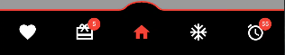
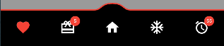
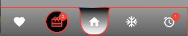
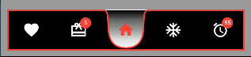
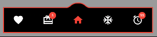
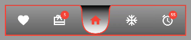
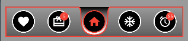
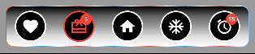
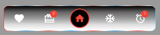

# Ultimate Bottom Navigation Bar

Ultimate Bottom Navigation Bar is a customizable bottom navigation bar for your Flutter applications. It allows you to easily create a navigation bar with icons and titles, and customize various aspects of its appearance and behaviors.

## Under Curve


## Upper Curve



## No Curve


## Static Curve




## Dynamic Curve


## Other Customiztions








## How To Use

Ultimate Bottom Navigation Bar can be used with Scaffold by setting up at bottomNavigationBar property.

Add this to your package's pubspec.yaml file, use the latest version

```yaml
dependencies:
  ultimate_bottom_navbar: ^latest_version
```

```dart
import 'package:ultimate_bottom_navbar/ultimate_bottom_navbar.dart';
    int currentIndex = 0;

    final List<String> title = [
        "Favourite",
        "Wallet",
        "Home",
        "Freeze",
        "Alarm"
    ];

    final List<IconData> icons = [
        Icons.favorite, 
        Icons.wallet_giftcard_sharp, 
        Icons.home, 
        Icons.ac_unit_outlined, 
        Icons.access_alarm_rounded, 
    ];

    final List pages = [
        const Page1(),
        const Page2(),
        const Page3(),
        const Page4(),
        const Page5(),
    ];
  
  @override
  Widget build(BuildContext context) {
    return Scaffold(
        body: pages[currentIndex],
        bottomNavigationBar: UltimateBottomNavBar(
            icons         : icons,
            titles        : title,
            currentIndex  : currentIndex,
            onTap         : (index) async => onItemTapped(index), 
        ),
    );
  }

  void onItemTapped(int index) async{
    setState(() {
        currentIndex = index;
    });
  }
```

## RTL Support

Works For Both RTL and LTR and can be configured with `Directionality`:

```dart
Directionality(
  textDirection: TextDirection.rtl,
  child: Scaffold(bottomNavigationBar:UltimateBottomNavBar()),
)
```

Check Out example project @ [example](example).

## Properties

| Property                         | Description                                                                          |
|----------------------------------|--------------------------------------------------------------------------------------|
| icons                            | Required Icons                                                                       |
| titles                           | Required Titles Use Empty Text For No Title                                          |
| currentIndex                     | Required Current Selected Index                                                      |
| backgroundColor                  | Solid Background Color                                                               |
| foregroundColor                  | Solid Foreground Color                                                               |
| foregroundStrokeBorderColor      | Foreground Stroke Solid Border Color                                                 |
| backgroundStrokeBorderColor      | Background Stroke Solid Border Color                                                 |
| backgroundStrokeBorderWidth      | Background Stroke Border Thickness                                                   |
| foregroundStrokeBorderWidth      | Foreground Stroke Border Thickness                                                   |
| backgroundGradient               | Background Gradient Color                                                            |
| foreGroundGradientShader         | Foreground Gradient Shader Color                                                     |
| foregroundStrokeGradientShader   | Foreground Stroke Border Gradient Shader Color                                       |
| backgroundStrokeGradientShader   | Background Stroke Border Gradient Shader Color                                       |
| navMargin                        | Bottom Navigation Margin                                                             |
| backgroundBorderRadius           | Background Border Radius                                                             |
| selectedIconColor                | Selected Icon Color                                                                  |
| selectedIconSize                 | Selected Icon Size                                                                   |
| selectedTextSize                 | Selected Text Size                                                                   |
| selectedTextColor                | Selected Text Color                                                                  |
| unselectedIconColor              | Unselected Icon Color                                                                |
| unselectedIconSize               | Unselected Icon Size                                                                 |
| unselectedTextSize               | Unselected Text Size                                                                 |
| unselectedTextColor              | Unselected Text Color                                                                |
| showForeGroundStrokeAllSide      | Show Foreground Stroke Border All Sides                                              |
| showBackGroundStrokeAllSide      | Show Background Stroke Border All Sides                                              |
| useForeGroundGradient            | Use Foreground Gradient Color                                                        |
| showForeGround                   | Show Hide Foreground                                                                 |
| useForegroundShaderStroke        | Use Foreground Shader Border Stroke Color                                            |
| useBackgroundShaderStroke        | Use Background Shader Border Stroke Color                                            |
| underCurve                       | Under Curve Or Upper Curve                                                           |
| staticCurve                      | Static Curve Or Dynamic Curve                                                        |
| showCircleStaticMidItemStatic    | Show Circle Decoration For Static Curve                                              |
| midItemCircleColorStatic         | Mid Item Circle Color For Static Curve                                               |
| midItemCircleBorderColorStatic   | Mid Item Circle Border Color For Static Curve                                        |
| showMidCircleStatic              | Show Mid Circle Or Hide For Static Curve                                             |
| midCircleRadiusStatic            | Mid Circle Radius For Static Curve                                                   |
| midCircleBorderRadiusStatic      | Mid Circle Border Radius For Static Curve                                            |
| customSelectedItemDecor          | Custom Selected Item Decoration                                                      |
| customUnSelectedItemDecor        | Custom Unselected Item Decoration                                                    |
| badgeData                        | Badge Data For Individual Item                                                       |
| badgeColor                       | Badge Background Color                                                               |
| badgeTextStyle                   | Badge Text Style                                                                     |
| badgeCircleRadius                | Badge Circle Radius                                                                  |
| badgeTopPosition                 | Badge Top Position                                                                   |
| badgeBottomPosition              | Badge Bottom Position                                                                |
| badgeLeftPosition                | Badge Left Position                                                                  |
| badgeRightPosition               | Badge Right Position                                                                 |
| animationType                    | Animation Type                                                                       |
| animationDuration                | Animation Duration                                                                   |
| onTap                            | Item Tap Function                                                                    |

## FAQ

Create a feature requests or bugs @ [issue tracker](https://github.com/saginbajracharya/ultimate_bottom_navbar/issues).
